<picture>
  <source media="(prefers-color-scheme: dark)" srcset="dark.svg">
  <source media="(prefers-color-scheme: light)" srcset="light.svg">
  
</picture>

  
  

## 🚀 About Me

I am a passionate **Artificial Intelligence Engineer** and **Full Stack Developer** specializing in Generative AI, Machine Learning, Computer Vision, and high-performance Web Systems. I create intelligent agents, build interactive dashboards, and design next-generation user experiences.

- 📍 **Location:** Nagpur, Maharashtra, India
- 🎓 **Education:** B.Tech in Artificial Intelligence, St. Vincent Pallotti College of Engineering & Technology (CGPA: 8.58, Graduating: 2027)
- 💼 **Current Role:** AI & Data Analytics Intern at **Acube AI** | AI Engineer Intern at **RNR Innotech**
- 🚀 **Current Focus:** AI Agents, Executive BI Systems, Computer Vision (YOLOv8), and Cloud Deployment

---

## 🛠️ Tech Stack & Skills

### 🧠 Artificial Intelligence & Data Science

  
  
  
  
  
  
  

### 💻 Web Development & Systems

  
  
  
  
  
  
  

### 🗄️ Databases & DevOps

  
  
  
  
  
  

---

## 🤖 Featured Projects

<table>
  <tr>
    <td width="50%">
      <h3 align="center">🤖 RIM AI ERP</h3>
      
A next-gen Enterprise Resource Planning tool featuring executive BI dashboards, ML-driven inventory forecasting, and conversational data analytics agents.

      

        
        
        
      

    </td>
    <td width="50%">
      <h3 align="center">♻️ Smart Waste Segregation</h3>
      
An IoT-enabled smart waste bin powered by YOLOv8 and Raspberry Pi, achieving automated classification of plastic, paper, metal, organic, and e-waste.

      

        
        
        
      

    </td>
  </tr>
  <tr>
    <td width="50%">
      <h3 align="center">🖥️ Jarvis AI Desktop Assistant</h3>
      
Voice-driven personal assistant capable of automating local system management, answering complex queries, and orchestrating workflow automations.

      

        
        
        
      

    </td>
    <td width="50%">
      <h3 align="center">📊 Data Analytics Dashboard</h3>
      
Premium interactive BI dashboard containing advanced metrics visualizations, forecasting tools, and multi-source data ingestion pipelines.

      

        
        
        
      

    </td>
  </tr>
</table>

---

## 📈 Live GitHub Statistics

  
  

  

---

## 🤝 Let's Connect!

  
  
  
  
  

